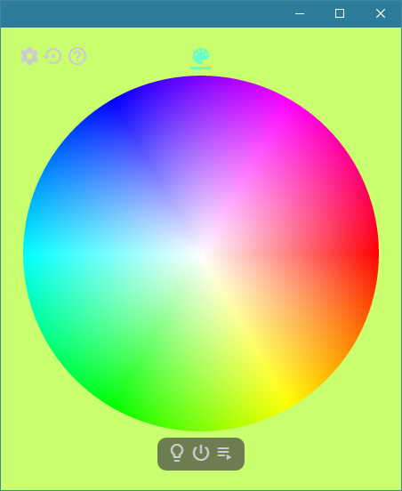
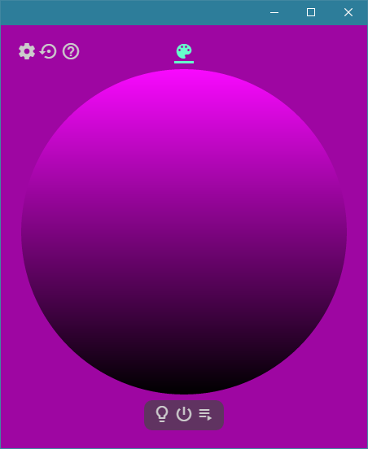
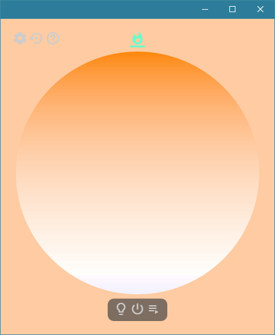
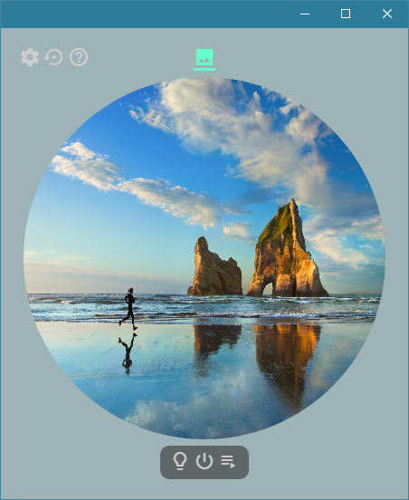
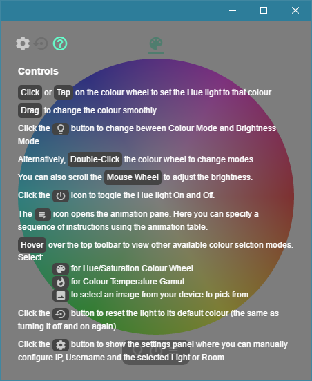
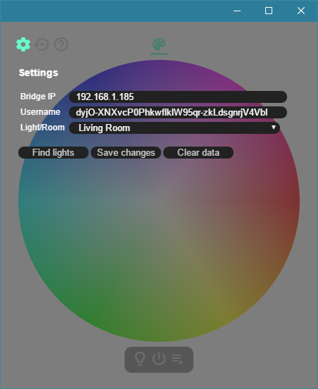

# Hue Controller
This project contains a web page the uses an `XMLHttpRequest` on your local network to send JSON data to the Hue Light.

## Hue Bridge Setup
Please ensure that you have a working Hue Bridge set up on your local network.
The app will automatically connect to it.
For first time use, you will be required to press the link button on the Hue Bridge when prompted.

##### Manual Configuration
You can change the IP, Username and Lights/Rooms from the settings page.

## Chrome App Dev Installation
Download a copy of the repository.
In Chrome, navigate to the extensions page chrome://extensions/
Drag and drop the `src` directory into the extensions page for a developer install.

The Hue Controller will now be accessible from the start menu and from chrome://apps/

## Release
The project will be eventually be released in the Chrome Store.
There are also plans to create a mobile version using PhoneGap

## Screenshots

##### Hue-Saturation Colour Wheel Picker

##### Brightness Picker

##### Colour Temperature Gamut Picker

##### From Photo Picker

##### Animation Sequencer

##### Settings

##### Controls

